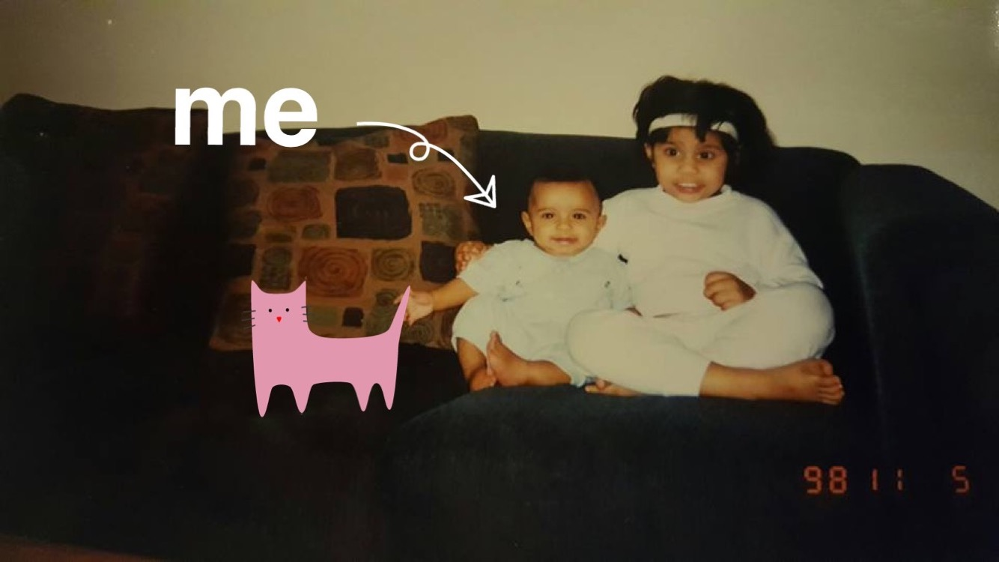

I'm a Freshman studying Computer Science at Georgia Tech with a passion for learning, entrepreneurship, art, and creating. I was raised outside of Philadelphia in a small village known as [Downingtown](https://en.wikipedia.org/wiki/Downingtown,_Pennsylvania) 🏡 where I grew up like any other kid: taking apart vacuum cleaners, fixing my neighbor's snowblower engine, and taking home broken computers from school. This kind of curiosity and love of learning have been something I've had for life.

Interestingly enough, I didn't write my first line of code until going to the PennApps 2015 Hackathon. I remember walking into the stadium and being surrounded by brilliant kids who could understood data structures and DOM manipulation as well as I understood how a Volkswagen W8 worked. It was this sort of attraction with an area that I never really explored that drove me to major in Computer Science and so far I love it!

Before this however, my background lied primarily in computers and 3D printing. My [high school](http://www.dasd.org/STEM) had bought a couple of machines to incorporate into the engineering classes and I was absolutely blown away how I could design something in 3D and manufacture any part I wanted. The mechanical engineer in me was bursting with excitement so I convinced my dad to buy me a really cheap printer. If you have ever used the XYZ DaVinci 1.0, which was the printer I subsequently bought, it is absolutely awful 🤢. I spent everyday, for 2 months, learning, tweaking, modifying, and repairing that aggravating hunk of metal to get better quality prints; even going so far as to flash the stock firmware with a Repetier mod. During the process however, I learned an insane amount and was soon enough tuning my school's printers, fixing broken ones, as well as acquiring a funny story about schooling a Lockheed engineer on the horribleness of MakerBots. 💪🏽

[Cycle3D](http://ash.bhimasani.com/pages/projects/cycle3d/) was the synthesis of all of this knowledge as I realized just how wasteful current 3D printing methods can be. Exploring this idea over the next year turned out to be an incredible experience as I was forced out of my comfort zone and had to grow as a leader, engineer, and person. One day I would be presenting in front of the school board and the next I would be grinding in the school lab trying to prototype a new idea. All of this energy to create eventually dripped its way into my more creative side as I realized I wanted to explore film & photography more after graduation.

I definitely was always fascinated with art and more specifically film growing up but I became way more interested towards the end of my senior year as the seriousness of college admissions faded and the opportunity to immerse myself emerged. The experimental/abstract nature of my photos was more of an accidental style that I developed while playing around with colors and anything I could find in the house. My goal is to combine this desire to create experimental media with my tech-focused education in a way that is organic as well as useful. Whether it be through [Graph House](http://ash.bhimasani.com/pages/work/graph-house/) or directing my own projects in Atlanta, I'm open to whatever comes my way.

As for my current situation, I couldn't be in a better place. The opportunity that Georgia Tech and Atlanta provides is something that motivates me to get out of bed everyday and work towards something whether it be learning how to write stock algorithms or simply reading extensively about Blockchain technology in the financial sector. My motivation & ambition is what keeps me alive and I'm confident that the future looks bright.

### Quick 💖 List:

- Biryani
- Brazilian Jiu-Jitsu
- `#ff9999`
- Nicolas Winding Refn
- 💵💵💵💵💵
