Cycle is an open source 3D printing project focused on creating a new type of 3D printer that can essentially recycle its own prints and utilize other recyclable plastics like PET or HDPE which is most often found in plastic containers. The project originally started as simple machine that can create filament out of ground up plastic but has since evolved into an "all-in-one" type of printer that can directly intake granular plastic instead of filament. Because of this concept, the two major components of the Cycle printer is the Grinder and Extruder with each partaking in the recycling process. Because this is an open source project, all the files mentioned in this project can be found at my [Cycle3D repository](https://github.com/16abhimasani/Cycle3D).

## Grinder Diagram

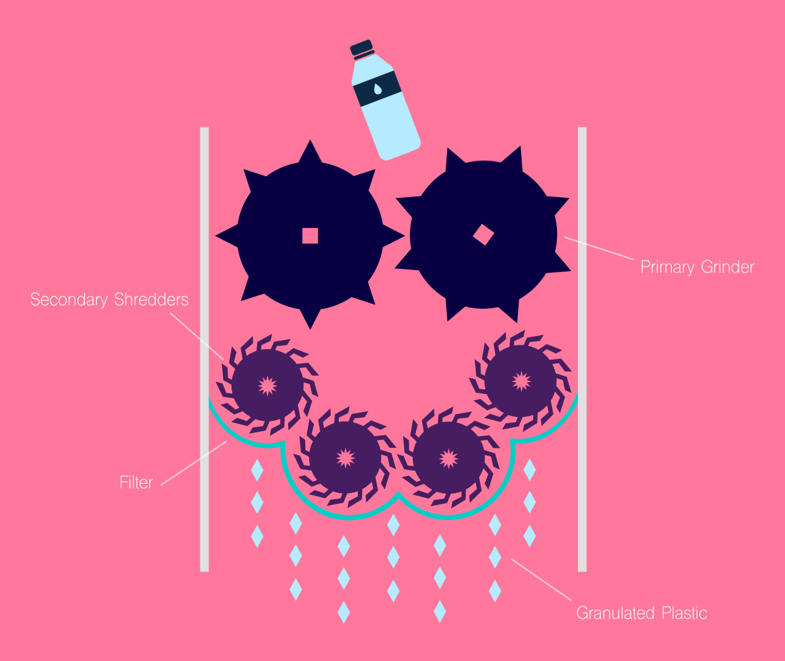

The Grinder works by first crushing and tearing plastic with the primary rollers. Next the shards are dropped into the secondary shredders where the high speed and sharp blades cut the plastic to small pieces. The filter below, fitted with 2 mm holes, allows oversized pieces to be kicked back up for more shredding. Overall the grinding part of Cycle printer is the most mechanically difficult because proper extrusion requires uniform piece size and shape. The filter part of this design minimizes bad pieces but overall the mechanical aspect of this design is still a work in progress.

## Extruder Diagram

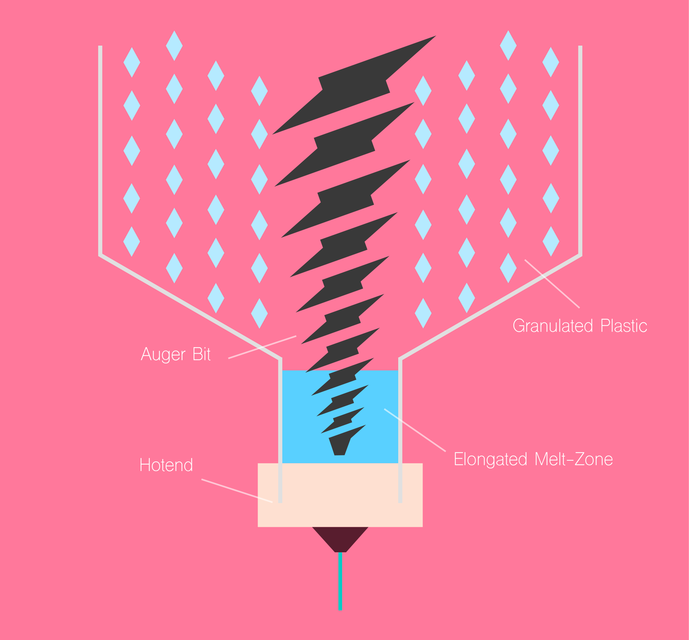

The Extruder works by intaking granulated plastic and passing it down the chamber via an Auger bit. This chamber is specifically designed to have a longer melt zone for efficient flow rate and retraction. The Auger bit allows the granular plastic to be carried down by the stepper motors in the extruder head. This method also allows simple retraction identical to normal extruder by simply reversing the motor to pull material back up.

>The future of 3D printing can be summarized by the progression of recyclable material technology

## Grinder

An overview of the Grinder's technical specification, design features, and build log.

### Grinder Assembly

#### Assembly and Cross Section

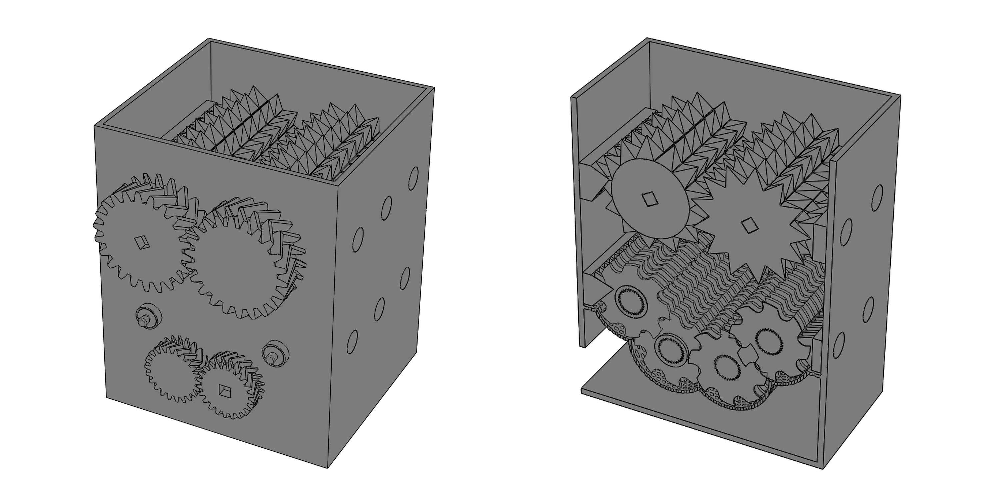

The goal with the grinder was to design a compact grinding solution that could reduce big milk jugs or small scrap plastic to 2mm granular pieces. This size is optimal for the extruder to handle at reasonable torque. For this reason I knew that simply throwing everything into a blender wasn’t going to work. I decided to design the grinder to use a 2 step grinding process. The primary grinder section at the top intakes raw plastic (like water bottles) and shreds them at slow speeds, essentially tearing the material into manageable chunks. The secondary shredders are the second step of this process where the large chunks are reduced to smaller pieces through multiple shredders. The filter at the bottom allows pieces that are not small enough to be kicked back up into the shredders until uniform size is achieved. This vertical grinding process in theory generates the best results but an ideal grinder (cheap and simple) would only have 1 stage shredding designed in such a way that thin walled plastic can be chewed up right away.

#### Gear Assembly and Box

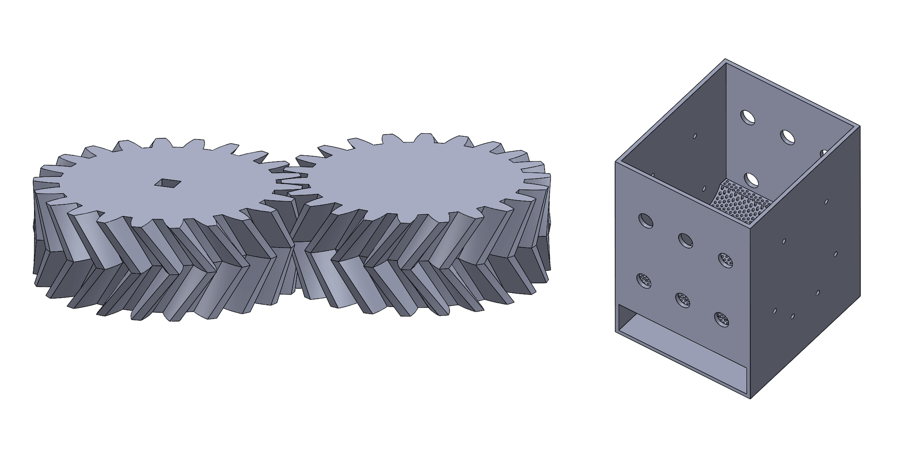

To drive the grinder and provide adequate torque and speed, I decided to use Herringbone gears. The advantage of Herringbone gears is that side load on the gear is reduced so there is a much more efficient transfer of torque and smooth motion. Also, because the part is 3D printed, a Herringbone design provides a more structurally stable part with less density.   I also decided to us a square axle so adhesives or fixtures wouldn’t have to be used to keep the axle from rotating within the gear. The gears also have square cutouts for motor mounting or hand crank attachment. Instead of directly attaching the motors we have to the gears I wanted to use a square adaptor so any motor or a hand crank can be fitted. Getting the fitting for these adaptors was difficult and will take a few tries because ABS can shrink about 8% and PLA shrinks anywhere from 2% to 5%.

#### Bearing Holder and Axle Cap

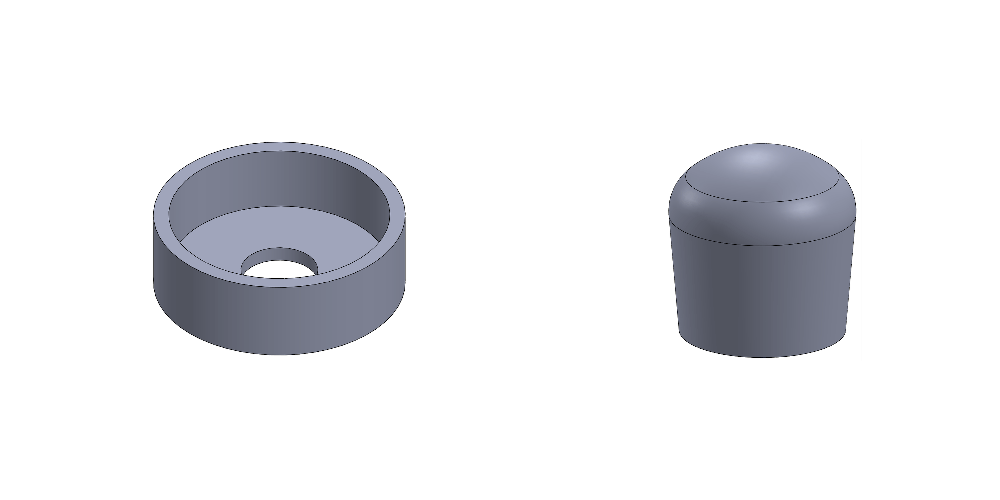

The axle runs all the way through the cylinders and box so I needed a way to cap the end so nothing moved. The simplest solution was a cap that can be right on the end of the axle once assembly is complete. The bearing holder does exactly what it sounds like: it holds a bearing. The holder is designed for a standard 8mm skate bearing that can be bought online or any skate shop. The part can be scaled up or down depending on the size of the bearing. Bearings are used to provide smooth rotation for the cylinders and shredders. The holders are designed to be embedded in the wall of box so cutouts for these are provided in the files.

### Primary Grinder

#### Rollers

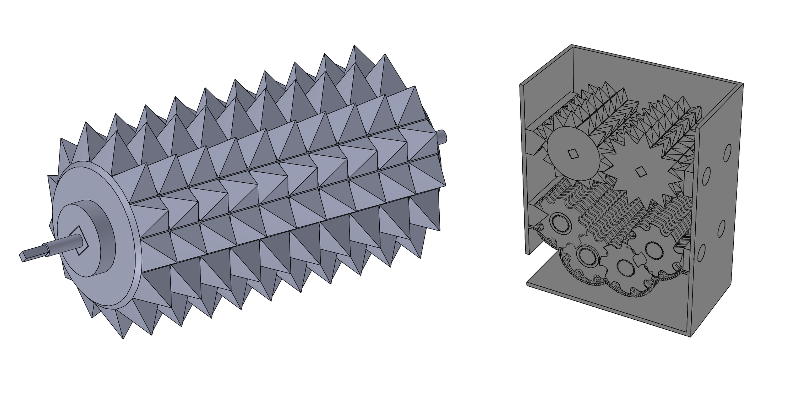

The rollers are the part that first processes raw plastic by tearing into smaller chunks that can be better handled. Every part of the cylinder modular from the pegs to the axle. The 3D printer I used was a XYZ DaVinci 1.0 which has a build volume of 20x20x20 cm so I had to splice pieces that were too big like the cylinder into two pieces and rejoin them together. Both the complete part files and spliced part files can found on in the [repository](https://github.com/16abhimasani/Cycle3D). The spikes on the rollers are situated in such a way that the two roller mesh together when met with a small amount of gap between the teeth to provide a little wiggle room. I offset each cylinder by the spacing of the teeth (the little protruding disk on the cylinder is what does this; the other side of the roller is flat) in order to get the mesh correct because I had trouble directly offsetting the spikes in SolidWorks.

#### Primary Wall Spikes

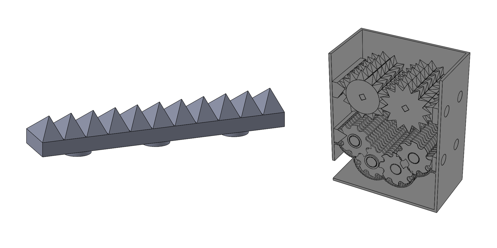

These wall spikes or blocks are really just used to create a tight seal between the rollers and the walls so no raw material falls through and sticks to the rollers. They are specific to the primary rollers so they cannot be used for the secondary shredders due to spacing between the spikes. The spikes also have pegs pre built into them so they can fitted right into the wall.

#### Split Axle

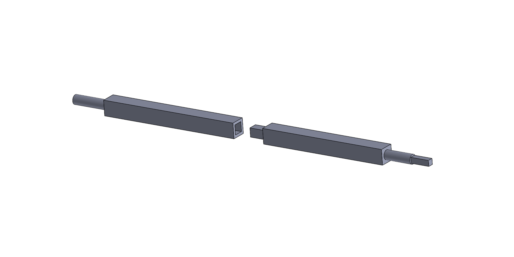

The axle, like many of the parts, is way too big to print so I have to split the axle into two two parts with a peg piece to fit them back together. The circular part of the axle is what fits into the bearing for smooth turning, while the square end fit into the gear. These axles are run through the entire roller so obviously there will be lots of friction. To fit the axle, I had to reduce the size just a bit with light sanding and turned the heat up on the extruder to induce extra shrinkage. A little oil also makes the axle slide in easier.

#### Roller Pegs

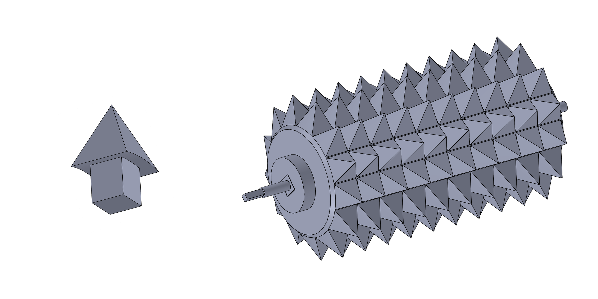

The pegs are pretty simple but it took a lot of tuning to get these to fit snuggly into the cylinder without a problem. To print, I laid the pegs flat on one surface of the spike so I only needed support material for the peg part. This can easily be filed away in post processing so this best way to print the pegs from my experience. The rollers require A LOT of pegs (around 130) so for the plastic prototype I’m printing pegs for every other row.

### Secondary Shredders

#### Blades and Shredders

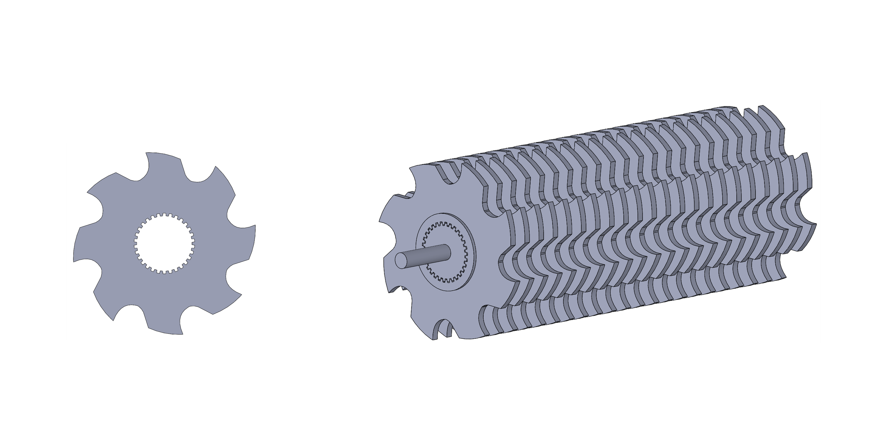

These are designed to be sharp and rotate fast in order to reduce plastic size down into something an extruder can handle. For the plastic prototype, the blades are being laser cut from acrylic reduce to labor time. Laser cutting for this reason is ideal. I designed the thickness of the blade to be 1/8 inch so I could use cheap acrylic to laser cut. There are 22 blades per rod so 88 blades for the entire secondary shredding system. For cutting, I stacked 2 sheets of acrylic and set the laser to cut 1/4 inch deep so I could have as few runs as possible.

#### Blade Spacers

The spacers are pretty simple, they fit onto the axle and keep a set distance between the blades so they mesh together nicely when installed into the grinder. These parts are laser cut because they are a simple flat disk shape and I needed a lot of them.

#### Shredder Axle

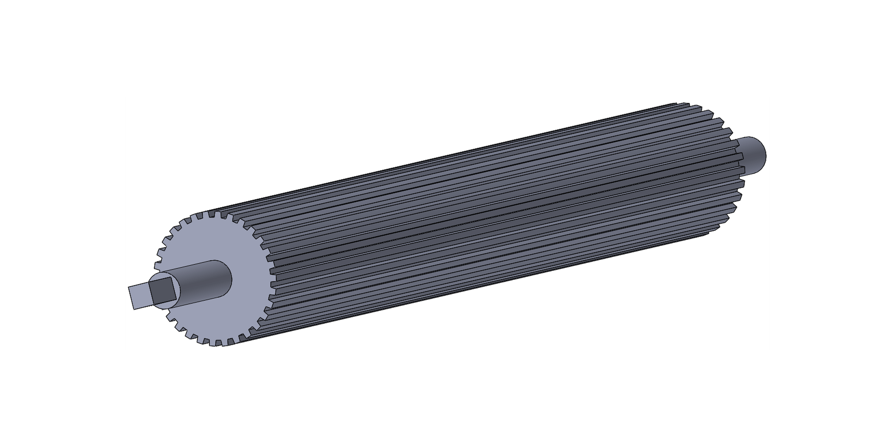

The axle is designed in this weird star shape so I could offset the rotation of each blade on the axle to get a more consistent grind. When the blades mesh together this staggering also improves smooth rotation and prevents jams.

#### Secondary Wall Spikes

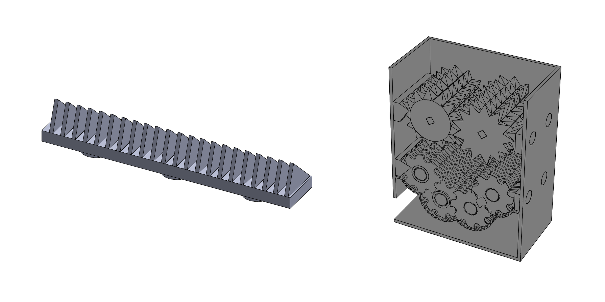

These are very similar to the primary wall spikes but the spacing is altered to mesh with the secondary shredders.

### Filter

#### Filtering Mesh

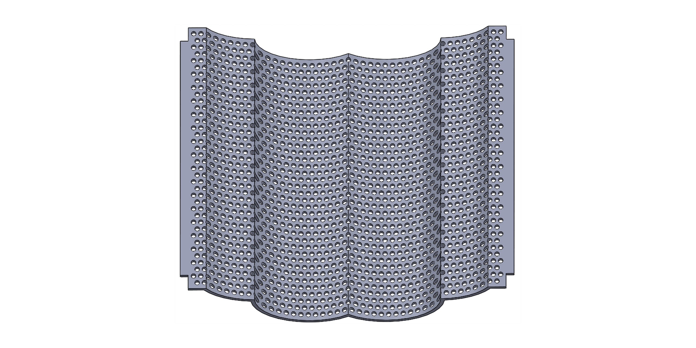

This filter is what keeps the granular pieces a uniform size. I made the holes a little bigger than 2 mm wide in order to get something small enough for the extruder. The Filter is the part of our grinder that needs the most work on and is non-functional as a plastic version. Everything else can be built with a combination of plastic and metal fabrication (so plastic cylinder and metal spikes) but the filter requires metal components to act like a grater.
